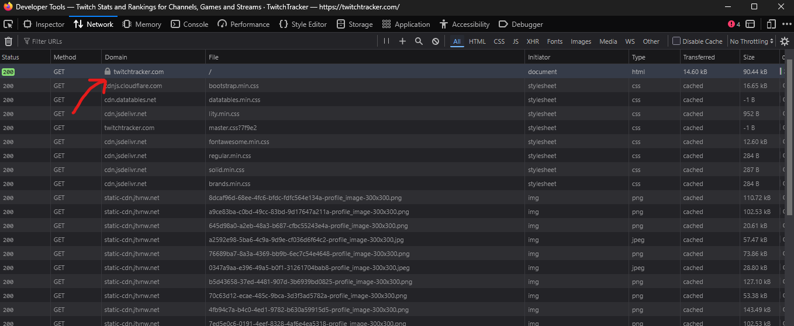
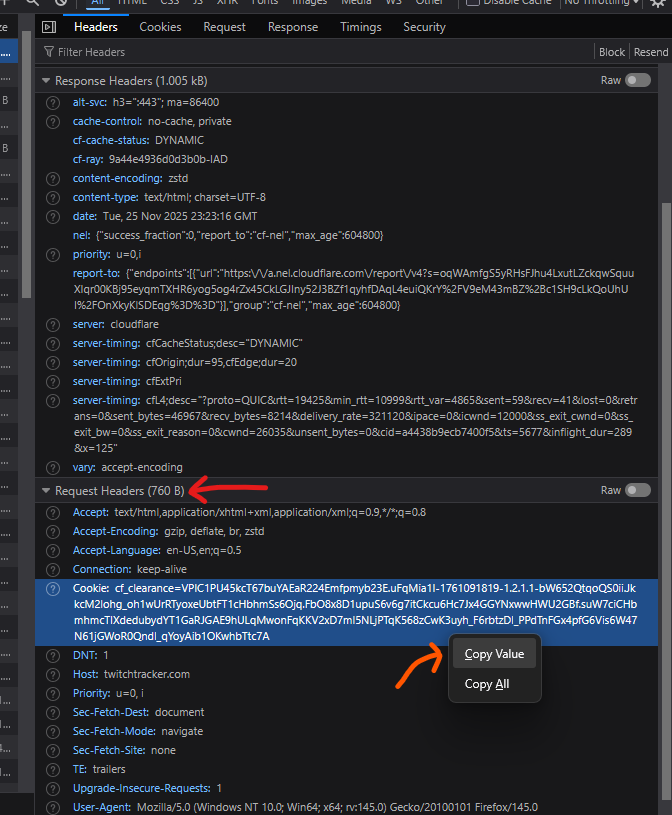

# Stream Time Scraper

A command-line tool that scrapes past stream metadata from TwitchTracker and exports it to a CSV file for analysis in spreadsheet applications.

## Overview

Stream Time Scraper fetches historical stream data for any Twitch user from their TwitchTracker page and parses it into a structured CSV format. The tool extracts stream metadata including dates, titles, duration, viewer statistics, and follower counts.

## Installation

1. Clone the repository:
```bash
git clone <repository-url>
cd stream_time_scraper
```

2. Build the project:
```bash
cargo build --release
```

The compiled binary will be available at `target/release/stream_time_scraper`.

## Cloudflare Cookie Instructions
Running this app requires you get a valid Cloudflare cookie from TwitchTracker. 

To do this you'll have to navigate to the [Twitch Tracker website at https://twitchtracker.com](https://twitchtracker.com).
From there, open the developer tools with `F12` or `Ctrl` + `Shift` + `I` and navigate to the `Network` tab.

Refresh the page if nothing shows up.

<br>

You'll see a long list of requests, these don't matter. Scroll up to the first one in the list. It should look something like this:

<br>



<br>

Clicking on that opens a new window. You're looking for one thing here. Scroll to the bottom of the list and 
you'll find a header that says `"Request Headers"`

<br>



<br>

<u>Right click</u> on the `Cookie` line, and click `Copy Value`.

This will put the cookie in your clipboard to be pasted into the command line with `-c "Cookie"` when running the app.

## Usage

### Example

```bash
stream_time_scraper -n "shroud" -c "cf_clearance=abc123...; __cflb=xyz789..." -o shroud_streams.csv
```
